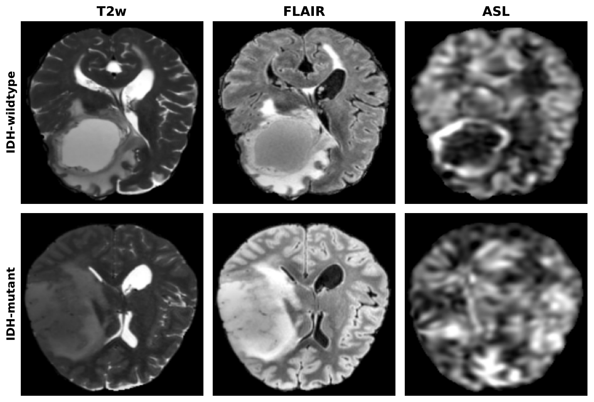
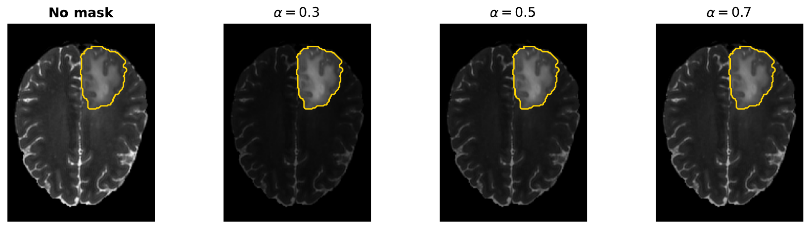
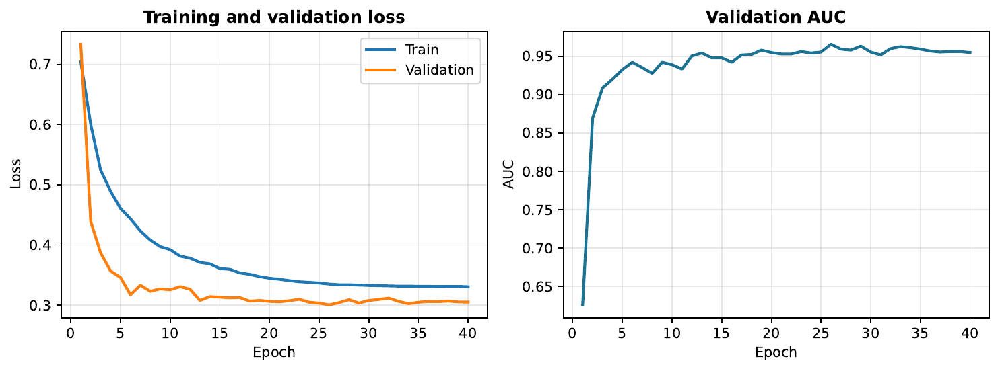
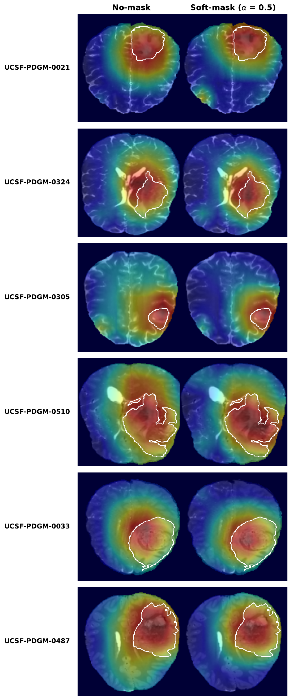

# Deep Learning-Based IDH Mutation Status Prediction in Gliomas: Evaluating the Contribution of ASL Perfusion MRI

My EE491 senior design project at Boğaziçi University: predicting the IDH mutation status of gliomas from contrast agent-free brain MRI, with no biopsy and no gadolinium, and measuring how much the ASL perfusion sequence helps.

**Author:** Ömer Yasin Çur
**Supervisors:** Prof. Esin Öztürk Işık, Prof. İbrahim Alpay Özcan

**Status:** The senior design project at Boğaziçi runs over two semesters, EE491 and EE492. This repository covers EE491, which is complete. I will continue and extend the project in EE492 next semester, so it is still a work in progress.

## Abstract

Gliomas are the most common malignant primary brain tumors in adults. The 2021 World Health Organization (WHO) classification makes isocitrate dehydrogenase (IDH) mutation status a central part of glioma diagnosis, as IDH-mutant and IDH-wildtype tumors behave differently. Knowing the IDH status before treatment is important, but it is currently determined through invasive tissue sampling. Deep learning applied to MRI offers a non-invasive alternative, but most existing approaches rely on contrast-enhanced imaging (using gadolinium), which has its own clinical drawbacks. This project investigates whether IDH mutation status can be predicted entirely from contrast agent-free brain MRI. We use three contrast agent-free sequences (T2w, FLAIR, and ASL) and a 2D ResNet-18 model that is pre-trained on ImageNet. We compare a plain (no-mask) pipeline with a soft-mask pipeline that highlights the tumor while keeping the whole-brain context, and we measure how much the ASL (perfusion) sequence contributes. On the UCSF-PDGM dataset, the best model (soft-mask, alpha = 0.5) reaches a test AUC of 0.987. Removing ASL lowers the AUC, which shows that perfusion carries useful information. As these results are based on a single data split, they should be considered preliminary.

## Aims

1. Can we predict IDH status using only contrast agent-free MRI (T2w, FLAIR, and ASL)?
2. How much does ASL (Arterial Spin Labeling) perfusion add to the prediction?

We also test a smaller question: does it help if the model focuses more on the tumor? We call this idea a soft mask.

The model is a ResNet-18 pre-trained on ImageNet. It takes the three contrast-free sequences as its 3 input channels, makes a prediction for each slice, and then averages the slice scores to give one prediction per patient.

## Results

All numbers are on the held-out test set (99 patients, 21 mutant and 78 wildtype). The main model uses the soft mask with alpha = 0.5.

| Metric | Value |
|---|---|
| AUC | 0.987 |
| Sensitivity (Recall) | 0.952 |
| Specificity | 0.936 |
| Precision | 0.800 |
| F1 | 0.870 |
| Accuracy | 0.939 |

We correctly found 20 of the 21 mutant patients, and missed only one.

The soft mask helps a little. The AUC goes from 0.971 (no mask) to 0.987 (alpha = 0.5):

| Configuration | Test AUC |
|---|---|
| No mask (alpha = 1) | 0.971 |
| Soft mask, alpha = 0.3 | 0.974 |
| Soft mask, alpha = 0.5 | 0.987 |
| Soft mask, alpha = 0.7 | 0.979 |

ASL helps a lot. Every combination that includes ASL beats every combination without it. ASL on its own (0.966) is already better than T2w and FLAIR together (0.939). Adding ASL to the two structural scans raises the AUC by 0.048:

| Sequences | Test AUC |
|---|---|
| FLAIR | 0.918 |
| T2w | 0.939 |
| T2w + FLAIR | 0.939 |
| ASL | 0.966 |
| FLAIR + ASL | 0.967 |
| T2w + ASL | 0.971 |
| T2w + FLAIR + ASL | 0.987 |

We used a single train/validation/test split, so these results are preliminary.

## Figures

Three contrast agent-free sequences (top row is IDH-wildtype, bottom row is IDH-mutant):



The soft mask. The tumor keeps its full intensity and the rest of the brain is scaled by alpha:



Training curves (loss for training and validation, and validation AUC):



Grad-CAM, which shows where the model looks (no-mask vs soft-mask). The attention falls on the tumor and the area around it:



## Method

**Dataset.** We use the UCSF-PDGM dataset (University of California San Francisco, Preoperative Diffuse Glioma MRI). It has 495 patients, about 21% of them IDH-mutant (103 mutant and 392 wildtype). We split the patients 60/20/20 into 297 / 99 / 99 (stratified, seed 63). We only use the three contrast-free sequences, and we look at the test set once, at the very end.

**Preprocessing.** The scans come already co-registered and skull-stripped. For each modality, inside the brain mask, we clip to the 0.5 to 99.5 percentile, apply a z-score, and then min-max scale to [0, 1] (background set to 0). We crop to the brain bounding box (with a 2% margin) and resize each slice to 224x224. We keep all axial slices where the tumor area is at least 250 voxels. Finally we stack T2w, FLAIR, and ASL as the 3 input channels.

**Soft mask.** We multiply each sequence by a soft weight map `m = alpha + (1 - alpha) * tumor`. Tumor voxels stay at 1.0 and the rest of the brain is dimmed to alpha (alpha = 1 means no mask). The model still sees the whole brain but pays more attention to the tumor.

**Model.** ResNet-18 pre-trained on ImageNet, with a 3-channel 224x224 input and a single output. It has about 11.2 million parameters.

**Training.** AdamW (learning rate 3e-5, weight decay 1e-4), dropout 0.2, 40 epochs, batch size 16, and a BCE loss with label smoothing 0.1. We balance the classes with a weighted sampler and use augmentation (flips, small rotations, scaling, gamma, noise), a warmup plus cosine schedule, and layer-wise learning rates (no frozen layers). We keep the same settings in every experiment so the comparisons are fair. We pick the best epoch by patient-level validation AUC, and average the per-slice probabilities into one prediction per patient.

**Interpretability.** We use Grad-CAM++ on the last convolutional stage (layer4).

## Repository structure

```
.
├── notebooks/
│   ├── 01_baseline_nomask.ipynb                  # no-mask (alpha = 1) baseline
│   └── 02_softmask_alphasweep_asl_ablation.ipynb # soft-mask alpha sweep, ASL ablation, Grad-CAM (main)
├── figures/                                      # figures used in the report and slides
├── report/
│   └── EE491_final_report.pdf
├── presentation/
│   └── EE491_presentation.pptx
├── requirements.txt
├── LICENSE
└── README.md
```

The two notebooks share the same data loading, preprocessing, model, and training code. The first one runs the plain 3-channel no-mask model. The second one runs the soft-mask alpha sweep (alpha = 0.3 / 0.5 / 0.7), the ASL ablation over modality subsets, and makes the Grad-CAM figures.

## How to run

```bash
git clone <your-repo-url>
cd <repo>
python -m venv .venv && source .venv/bin/activate   # optional
pip install -r requirements.txt
```

The UCSF-PDGM dataset is not included here, because it is large and has its own access terms. You can get it from The Cancer Imaging Archive (see Calabrese et al. below) and put it on your machine.

The path variables at the top of each notebook (BASE_DIR, DATA_DIR, CSV_PATH, CACHE_DIR, RESULTS_DIR, and the checkpoint paths) point to my own machine. You need to change them to your own data folder and a writable cache/results folder before you run anything. A GPU is recommended. Then run the notebooks from top to bottom.

## Future work (EE492)

For next semester I plan to:

- test the model on an outside dataset (external validation),
- try newer models such as Vision Transformers,
- move to volumetric (3D) analysis instead of single 2D slices,
- explore some generative AI ideas and add them to the project.

## References

1. D. N. Louis et al., "The 2021 WHO Classification of Tumors of the Central Nervous System," Neuro-Oncology, 2021.
2. E. Calabrese et al., "The UCSF Preoperative Diffuse Glioma MRI Dataset," Radiology: Artificial Intelligence, 2022.
3. K. He, X. Zhang, S. Ren, J. Sun, "Deep Residual Learning for Image Recognition," CVPR, 2016.
4. J. Deng et al., "ImageNet: A Large-Scale Hierarchical Image Database," CVPR, 2009.

## Author

Ömer Yasin Çur, Boğaziçi University, Electrical and Electronics Engineering. EE491 Senior Design Project, supervised by Prof. Esin Öztürk Işık and Prof. İbrahim Alpay Özcan.

Released under the MIT License (see LICENSE).
